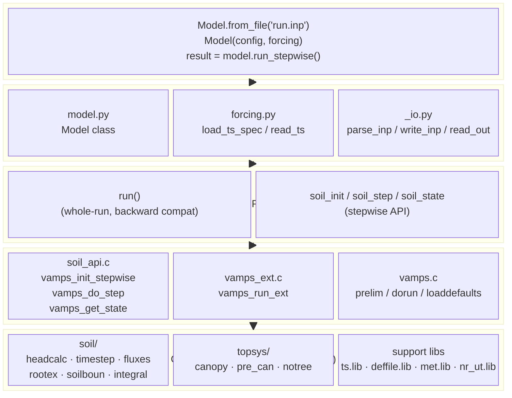
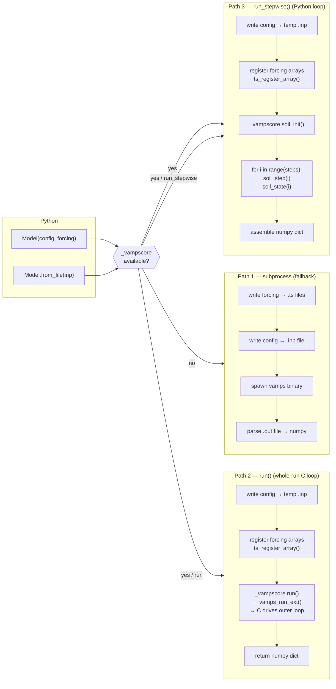
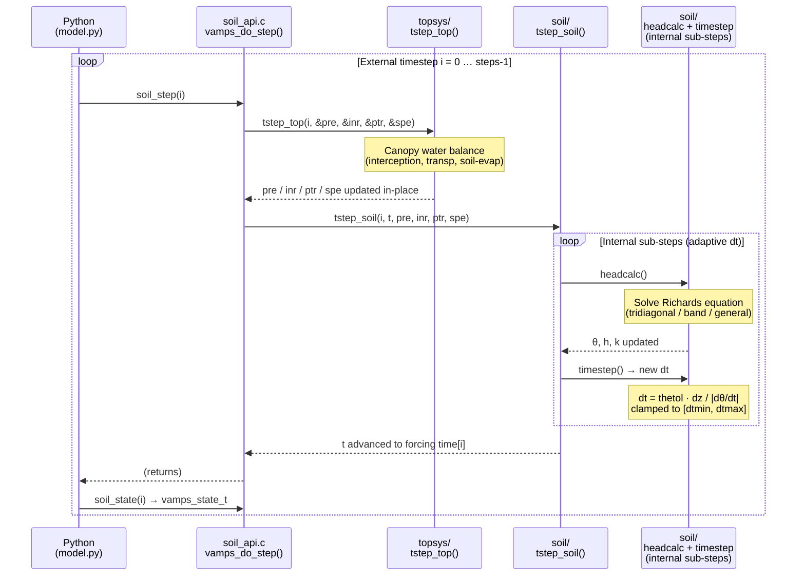
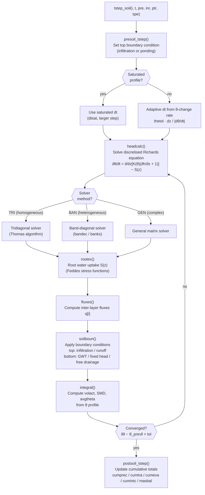
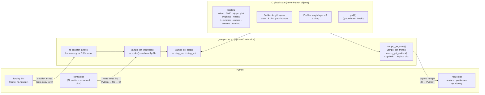
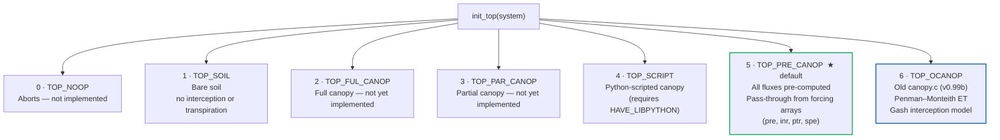
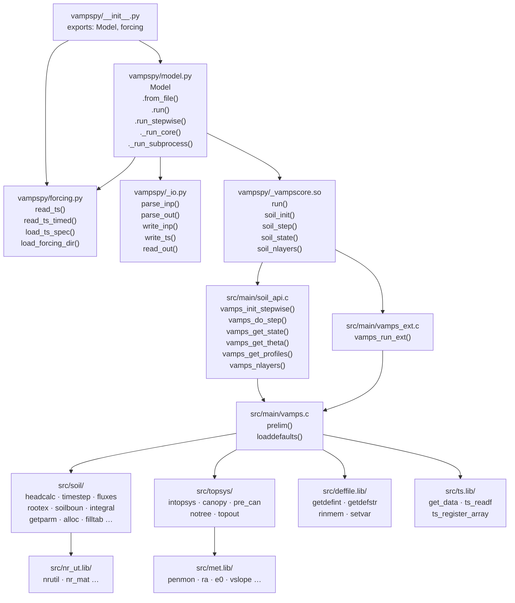
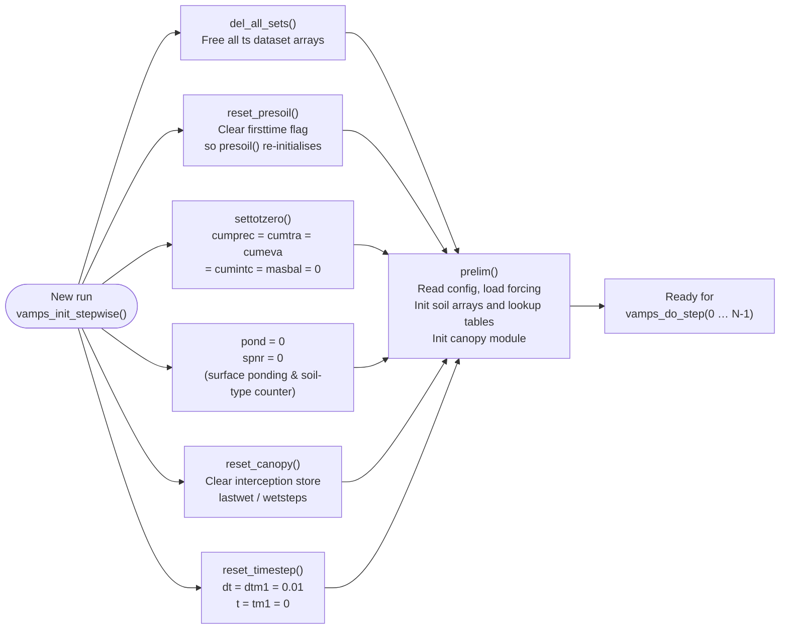
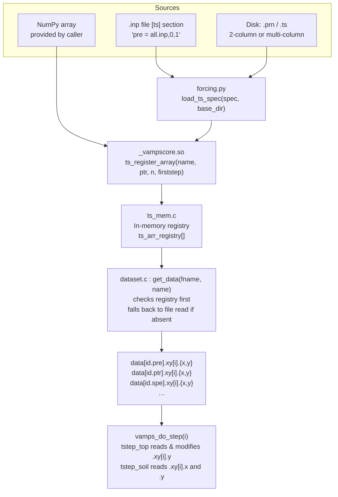
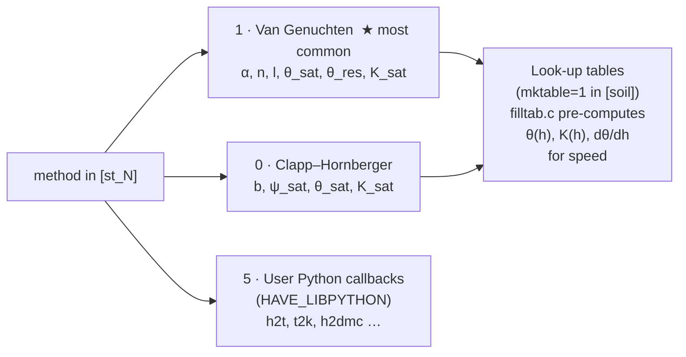

# VAMPS Architecture

VAMPS (VAriably saturated soil Model with Plant and canopy System) is a
1-D unsaturated-zone water-flow model.  The core physics — the Richards
equation solver with adaptive internal sub-stepping — is implemented in C.
All I/O, configuration, external timestep control, and post-processing live
in Python.

---

## 1. Layered overview

---

## 2. Three execution paths

The same `Model` class supports three routes to a result.  All three
produce bit-for-bit identical output.

---

## 3. Timestep hierarchy

VAMPS has two nested levels of time iteration.  Only the outer one is
visible to Python.

---

## 4. Soil physics pipeline (one external step)

---

## 5. Python ↔ C data boundary

What crosses the `_vampscore` extension interface, and what stays inside C:

### Result dict layout

| Key | Shape | Description |
|-----|-------|-------------|
| `t`, `volact`, `SMD`, `qtop`, `qbot`, `avgtheta` | `(steps,)` | Scalar time-series |
| `cumprec`, `cumtra`, `cumeva`, `cumintc`, `masbal` | `(steps,)` | Cumulative totals |
| `precipitation`, `interception`, `transpiration`, `soilevaporation` | `(steps,)` | Per-step canopy fluxes |
| `theta` | `(steps, nlayers)` | Volumetric water content |
| `k` | `(steps, nlayers)` | Hydraulic conductivity |
| `h` | `(steps, nlayers)` | Pressure head |
| `qrot` | `(steps, nlayers)` | Root water uptake |
| `howsat` | `(steps, nlayers)` | Degree of saturation |
| `q` | `(steps, nlayers+1)` | Inter-layer flux (includes top/bottom boundaries) |
| `inq` | `(steps, nlayers+1)` | Cumulative inter-layer flux |
| `gwl` | `(steps, 2)` | Groundwater table levels |
| `_steps`, `_nlayers` | int | Metadata |

---

## 6. Canopy top-system types

The topsys module selects a canopy implementation at initialisation via
`init_top(system)`.  The integer constant in the `[top]` config section
determines which is used.

---

## 7. Python module dependency map

---

## 8. State reset between runs

When starting a new run (whether via `run()` or `run_stepwise()`), several
C globals must be reset to avoid contamination from a previous run.

---

## 9. Forcing data flow

How forcing moves from a file or array into the C solver:

---

## 10. Soil hydraulic model variants

The C soil module supports three water-retention / conductivity relationships,
selected per soil type via the `method` key in each `[st_N]` config section.

